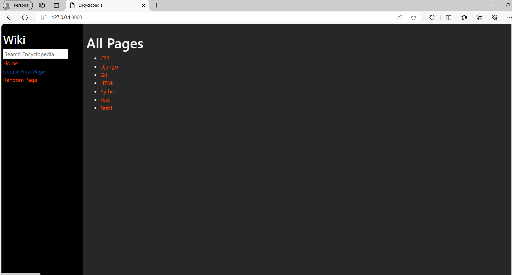
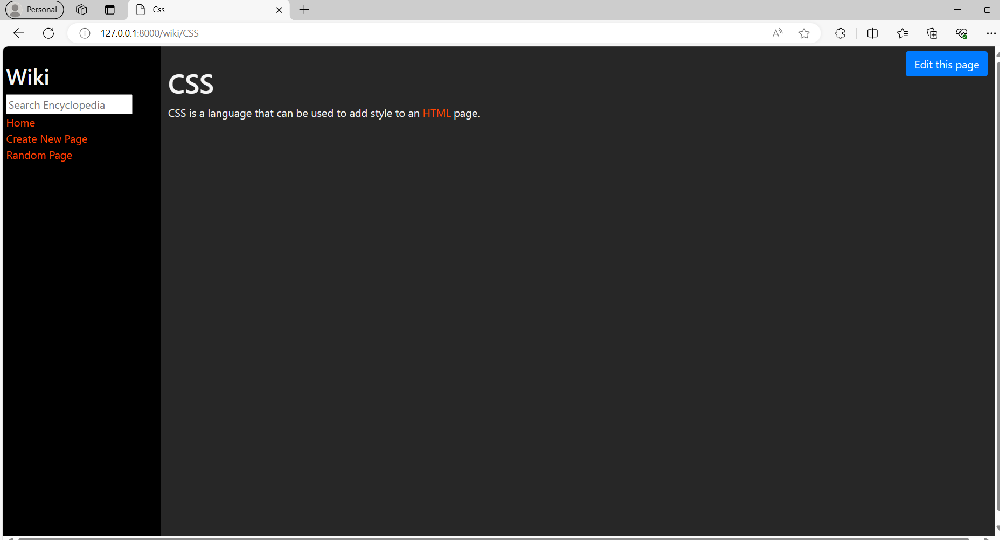
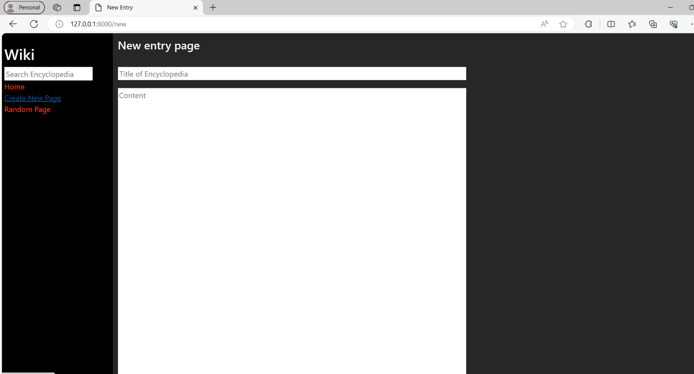

# Wiki

Description: A encyclopedia like website where you can create wikipedia articles.It uses github markdown syntax to to write contains of the articles.

### Features
* Search articles
* Create new articles
* Edit articles
* Show random articles

# Buit with
1. Django - 5.0.4
2. Bootstrap - 5.3
3. HTML - 5.3
4. CSS - 
5. Python - 3.11.1

## Author:
Krishnakant Pal
